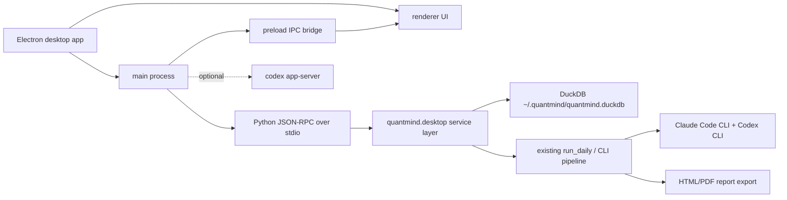

# QuantMind デスクトップアプリ化方針

## ステータス

GitHub Issue #42 の調査結果に、追加要件「Electron を使ったデスクトップアプリにする」を反映した実装方針。

## 要件

- QuantMind をブラウザで開く web アプリとして作らない。
- Electron を desktop shell として使う。
- 必要に応じて Codex app server を Electron main process から利用する。
- Claude Code/Codex の議論履歴を残す。
- 過去の議論履歴と抽出銘柄を確認できるようにする。
- 既存の Python CLI、DuckDB、HTML/PDF レポート出力は互換維持する。

## 調査結果

### Codex app server の位置づけ

インストール済みの Codex CLI は `codex-cli 0.118.0`。以下のサブコマンドが利用できる。

```bash
codex app-server
```

`codex app-server --help` から確認した要点:

- 既定の transport は `stdio://`。
- `--listen ws://IP:PORT` で WebSocket transport を使える。
- 非 loopback の WebSocket には認証モードがある。
- プロトコル型定義と JSON Schema を生成できる。
  - `codex app-server generate-ts --out <dir>`
  - `codex app-server generate-json-schema --out <dir>`

生成した protocol types から、app server は Codex desktop/CLI を操作する JSON-RPC surface だと確認した。代表的な method:

- `thread/start`, `thread/resume`, `thread/list`, `thread/read`
- `turn/start`, `turn/interrupt`
- `command/exec`, `command/exec/write`, `command/exec/terminate`
- `fs/readFile`, `fs/writeFile`, `fs/readDirectory`
- `app/list`, `plugin/list`, `skills/list`

重要な制約: Codex app server は QuantMind 専用の任意 HTTP endpoint や業務 UI を直接ホストするものではない。Electron app から必要な Codex runtime/control 機能へ接続するための補助レイヤーとして扱う。

### Electron 採用の判断

Electron を採用する場合、renderer は HTML/CSS/TypeScript で実装するが、ユーザー体験はローカル desktop app になる。ブラウザでアクセスする web app とは分けて扱う。

QuantMind の既存実装は Python CLI + DuckDB に寄っているため、Electron main process から Python service を起動し、IPC 経由で renderer に公開する構成が最も素直。

## 決定

QuantMind のデスクトップ化は Electron app として実装する。

やること:

- Electron main process をローカル実行の統制点にする。
- Python 側に `quantmind.desktop` service/read model 層を追加する。
- Electron main process と Python service は JSON-RPC over stdio で接続する。
- renderer は preload 経由の限定 IPC API のみ使う。
- Codex app server は必要な場合だけ main process から起動/接続する。

やらないこと:

- ブラウザで開く HTTP web app を主 UI にしない。
- renderer から DuckDB や shell を直接触らせない。
- HTML/PDF レポートを廃止しない。エクスポート artifact として残す。

## 構成



## 追加するファイル

Electron app:

```text
apps/desktop/
  package.json
  electron/
    main.ts
    preload.ts
  src/
    App.tsx
    main.tsx
    api.ts
  vite.config.ts
  tsconfig.json
```

Python 側の desktop integration:

```text
src/quantmind/desktop/
  __init__.py
  read_model.py
  service.py
  rpc_server.py
  schemas.py
```

必要になった段階で Codex app-server adapter を追加する。

```text
apps/desktop/electron/codex_app_server.ts
```

## IPC / service 境界

Electron renderer には preload から以下のような API だけを公開する。

- `listRuns()`
- `getDailySummary(date)`
- `listExtractedSymbols(date)`
- `getSymbolDetail(date, code)`
- `getDebateTranscript(date, code)`
- `runDaily(options)`
- `getRunStatus(runId)`

Python `quantmind.desktop.read_model` は read-only とし、繰り返し呼び出しても DB を変更しない。

- 実行日一覧
- 日次 pipeline summary
- 指定日の抽出銘柄一覧
- 銘柄詳細
- 指定日/銘柄の debate transcript
- 過去の銘柄・recommendation 検索

Python `quantmind.desktop.service` は操作系を包む。

- 日次 pipeline 実行
- 実行状態の取得
- 同時実行の防止
- `claude` / `codex` CLI がない場合の明確なエラー化

## セキュリティ方針

- `nodeIntegration: false`
- `contextIsolation: true`
- `sandbox: true` を基本にする。
- renderer から shell/DB/file system を直接触らない。
- preload の API は固定メソッドだけ公開し、任意 command 実行は公開しない。
- Python RPC は Electron main process の子プロセスとして起動し、localhost HTTP port は開けない。

## データ面の判断

既存テーブルで要件の一部は満たせる。

- `screening_daily`: 抽出銘柄を日付別に保持済み。
- `llm_decisions`: Bull/Bear/Judge の prompt/output を保持済み。
- `pipeline_runs`: step の実行状態を保持済み。

不足している点:

- `llm_decisions` は 1 回の debate/conversation 単位で grouped されていない。
- 失敗・途中終了した debate を 1 つの会話として復元しにくい。

このため #44 と #45 は引き続き必要。特に #45 で `run_id` または同等の grouping を入れる。

## 実装順序

1. #43: Electron IPC / Python RPC / service schema を定義する。
2. #44: DuckDB 既存テーブル上に read model helper を実装する。
3. #45: 今後の debate を conversation 単位で grouped する。旧データは日付/銘柄/role で best-effort 復元する。
4. #46: 履歴・議論・抽出銘柄を Python RPC と Electron IPC で公開する。
5. #47: 日次 pipeline 実行を guarded operation として公開する。
6. #48: Electron shell と主要画面を実装する。
7. #49: README/docs の主導線を Electron desktop app 運用へ更新する。
8. #50: 回帰テストと Electron E2E 確認を追加する。

## 実装時の確認コマンド

```bash
codex --version
codex app-server --help
codex app-server generate-ts --out /tmp/codex-app-server-types
uv run pytest
uv run quantmind run --no-discover --no-llm-debate
```

Electron app 追加後は以下を整備する。

```bash
pnpm -C apps/desktop install
pnpm -C apps/desktop dev
pnpm -C apps/desktop test
```

## 前提

ここでの「デスクトップアプリ」は Electron の独立 window を持つローカル app を指す。Codex app server は、QuantMind の UI host ではなく、必要な Codex runtime/control 機能に main process から接続する補助機能として扱う。
